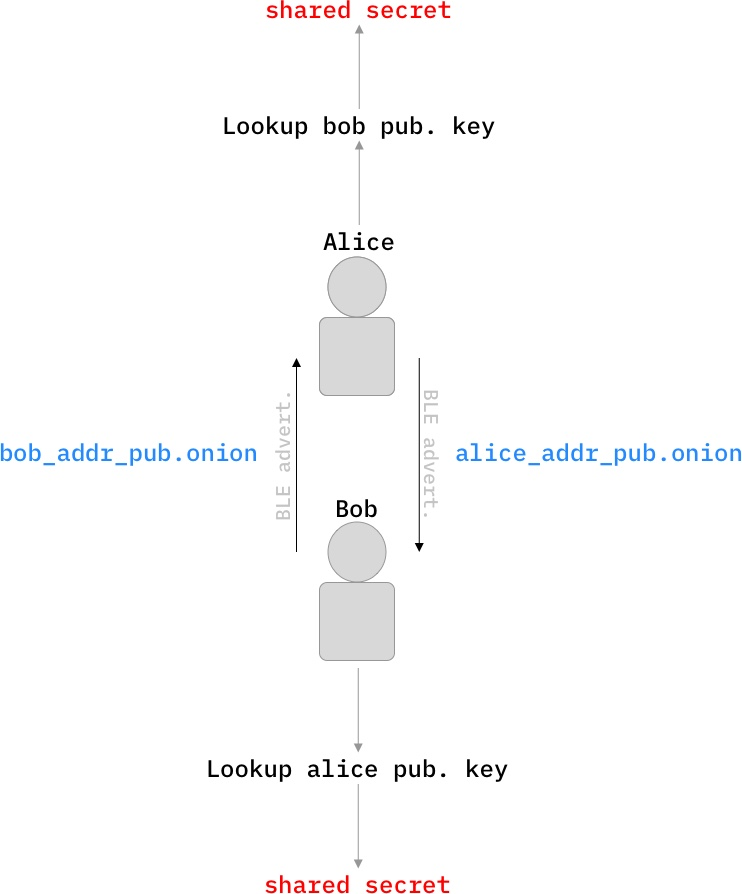
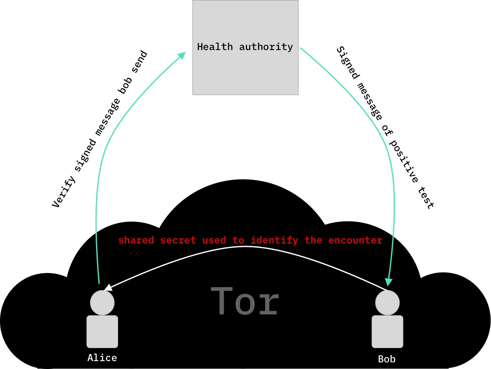

# Peer-to-peer contact tracing using Tor hidden services

Every phone using the app operates a [Tor hidden service](https://2019.www.torproject.org/docs/onion-services) which enables anonymous peer-to-peer communication between two phones that have come in contact.

Phones broadcast their Tor hidden service address via a peer-to-peer nearby device discovery mechanism (BLE, wifi, sound, ...).
Tor v3 addresses are used because they are generated from a `curve25519` public key, which enables both parties of an encounter arriving at a unique shared secret for each encounter via a Diffie-Hellman key exchange. Note that this shared secret would not change if the same two parties meet again as long both maintain the same Tor address. Consider this example:  

After this encounter Bob and Alice have a way of contacting and identifying the encounter totally anonymously trough the Tor network.

To verify infection reports a health authority could sign a message for the infected person which they then attach to their messages addressed to their contacts. For this to work health authorities need to have a publicly verifyable cryptographic identity, so that a infection reports can be verified by the receiving person. Note that this compromises the identity of the infected person to the health authorities, which is inevitable when being tested for a disease. Since the receiving party enjoys the anonymity guarantees of the Tor network when verifying the received message, their identity remains hidden.

## Problems

**Can i DDoS the phones of users since the hidden service addresses are exposed to nearby devices?** Yes and No. You can DDoS a phone you discovered but when a phone detects to much/malicious traffic it can shut down its service for the time beeing. In addition DDoS attacks are very ineffective in disturbing the majority of users which would be needed to reduce the overal benefit of the app, because there is no central backend to attack and attacking all devices is to expensive/ not feasible.

**Having bluetooth or any other connectivity protocols constantly enabled is a terrible idea from a security/privacy perspective.** True. German talk on this: ([35C3 ChaosWest - Track me, if you … oh.](https://www.youtube.com/watch?v=qMee_kEhLFI))
