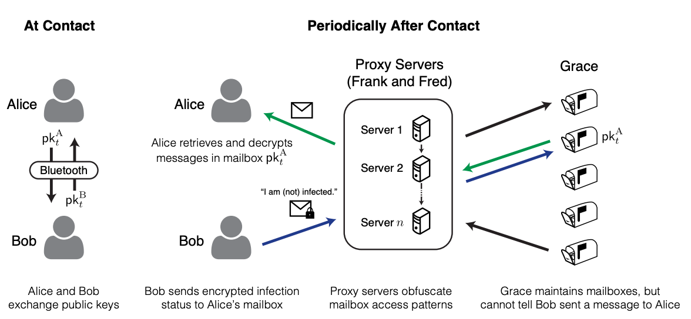

# Codars privacy preserving contact tracing model

Our privacy model is based the ideas outlined by Hyunghoon Cho, Daphne Ippolito and Yun William Yu in their paper ([Contact Tracing Mobile Apps for COVID-19: Privacy Considerations and Related Trade-offs](https://arxiv.org/pdf/2003.11511.pdf)).

Codar uses a private messaging system to achieve privacy from snoopers and privacy from the authorities. [1]

## Terminology
* BLE: Bluetooth low energy
* Encounter: refers to phones communicating over BLE or people meeting beeing in close proximity to each other 

## Architecture

[1] 

### Encryption scheme
We choose the elliptic curve `secp256k1` for our encryption scheme.
`secp256k1` is a popular curve due to Bitcoin and it also has small key sizes, which is better for storage on mobile devices.

### Public key exchange
The exchange of public keys ideally happens over BLE. For every new encounter a new key pair is generated. **Only public keys are exchanged, the private key remains on the phone**. Private key generation could happen randomly or deterministically [2] using a seed phrase which would enable recovery of encounter mailboxes. The seed would have to be random and the user should be able to back it up.

### Proxy Servers
The TOR network serves as proxy servers to avoid correlation of a users network identity with his public key.
The user has the option to choose his own TOR relay, but for the average user this is to complicated so an automatic lookup and selection of public relays is the default.

### Mailboxes
A mailbox is a collection of encrypted messages for the owner of the mailbox. A mailbox is addressed by the public key of the owner.

The mailbox backend is a scalable system made of FaaS and a Database. Currently codar uses Google Cloud Functions and Google Cloud Firestore, which are highly scalable serverless services, however we could switch to serverful solutions if needed.  

### Regular health report
Both parties of an encounter send regular messages to the mailboxes of their encounters, wether they are infected or not, this prevents the mailbox services from knowing the health status of associated with a public key.

### Verified test results
1. Health authorities generate their own `secp256k1` key pair and publish the public key.
2. The health authority provides a signed message to the patient, who can then attach this signed message to the messages he send to the mailboxes of his encounters.
3. The owner of a mailbox can check for an attached authority signature and verify it using the health authorities public key.

This approach preserves the privacy of the people the patient encountered, while verifying the authenticity of the report.

Problem: For this to work health authorities would have to cooperate, this is probably not always possible due to personal capacities and thats why codar also allows unverified results. *WE NEED HELP FOR THIS ONE* 

## Sources
1: [Contact Tracing Mobile Apps for COVID-19: Privacy Considerations and Related Trade-offs](https://arxiv.org/pdf/2003.11511.pdf)  
2: [Mnemonic code for generating deterministic keys](https://github.com/bitcoin/bips/blob/master/bip-0039.mediawiki)